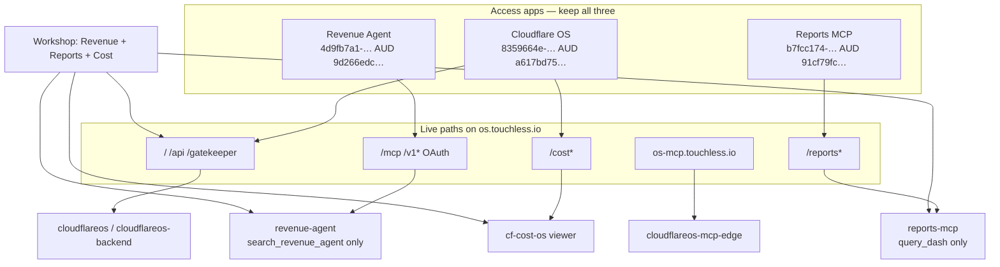

# Simplify OS / capability-worker architecture

> **For agentic workers:** REQUIRED SUB-SKILL: Use superpowers:subagent-driven-development (recommended) or superpowers:executing-plans to implement this plan task-by-task. Steps use checkbox (`- [ ]`) syntax for tracking. Do **not** implement from this file until asked. Do **not** edit `~/.cursor/plans/fix_two_gaps_b8e818cc.plan.md`.

**Goal:** Make Workshop the only Revenue surface, publish Reports MCP as `query_dash` only, and stop documenting thin-chat / dual-run as required — without merging Workers, Access AUDs, or hosts.

**Architecture:** Keep one hosted kernel (`cloudflareos` on `os.touchless.io`) plus capability Workers path-shared on that host (`revenue-agent` `/mcp` `/v1`, `reports-mcp` `/reports*`, `cf-cost-os` `/cost*`). Detach `chat.os.touchless.io` / `revenue-chat`. Hide `query_ets_ers` until `ETS_SCHEMA_ALLOWLIST` is non-empty. Leave `os-mcp.touchless.io` where it is. Do not add a fourth Access app.

**Tech stack:** Cloudflare Workers + Access (Touchless `100999ce2892ed4147ecde16eb4c0188`), Hyperdrive, Workshop named-tool grants. New Worker code lives in `touchless-ops` only.

**As of:** 2026-08-14 (live shape).

## Global constraints

- Do **not** merge Reports Neon SQL into `revenue-agent`.
- Do **not** merge Access AUDs (OS `a617bd75…` vs Revenue `9d266edc…` vs Reports `91cf79fc…`).
- Do **not** overlay starter `touchless-os` onto `os.touchless.io`. Treat `os.touchless.io` and `revenue.touchless.io` as forbidden starter deployment targets; deploy-script changes are outside this docs-only handoff.
- Do **not** grant `gmail_*` or bare `/mcp` into OS workspaces. Revenue grant stays `https://os.touchless.io/mcp#tool=search_revenue_agent`.
- Prefer `touchless-ops` for Worker edits. No `touchless-core` / `core-db` / exo edits.
- Slack / OpenClaw Mini keeps Excel dispatch until an R2 phase.
- Do **not** add `revenue.os.touchless.io`.
- Leave `os-mcp.touchless.io` (`cloudflareos-mcp-edge`, Salesforce portal) unless OAuth is painful. Nesting to `mcp.os.touchless.io` is DNS-only and last.

---

## Goal / non-goals

### Goal

Collapse the live company OS to the smallest topology that still works:

1. **Workshop-only Revenue** — drop thin chat until reps bounce off Workshop.
2. **Reports v1 = `query_dash` only** — hide `query_ets_ers` from tools/list and `/v1/mcp/info` until ETS discovery fills the allowlist.
3. **Docs match live** — no dual-run, no required thin-chat, no `revenue.touchless.io` as a live bind.

### Non-goals (this plan)

- ETS/rudderstack discovery, new Hyperdrive, or promoting `query_ets_ers`.
- Dedicated Dash Hyperdrive with `touchless-core-read-only` (keep temp `78c0e67707bb4339862a04299cf551c4`).
- Completing the Reports Workshop Any-MCP bind (BCM `window.open`; still human). When it happens, grant **`query_dash` only**.
- Nesting `os-mcp.touchless.io` → `mcp.os.touchless.io`.
- Deleting `apps/revenue-chat` from git on day one (park it; restore if reps bounce).
- Eng workspace / exo-rag.
- Changing OS / Revenue / Reports Access *policies* or IdP allowlists.

---

## Target topology



**Dropped from required live shape**

| Drop | How |
|---|---|
| `chat.os.touchless.io` / Worker `revenue-chat` | Unbind custom domain, then drop from Revenue Access dests. Park source in `touchless-ops/apps/revenue-chat`. |
| `query_ets_ers` in MCP catalog | Do not `registerTool` / advertise while `ETS_SCHEMA_ALLOWLIST` is empty. Keep SQL helper in-tree. |
| `revenue.touchless.io` | Already detached. Do not re-attach. |
| `revenue.os.touchless.io` | Never create. |

**Rep surface:** `https://os.touchless.io` Workshop only (Revenue workspace already smoke-green).

---

## File map

| Path | Role in this plan |
|---|---|
| `touchless-ops/apps/revenue-chat/wrangler.jsonc` | Remove `chat.os.touchless.io` custom-domain route. |
| `touchless-ops/apps/revenue-chat/README.md` | Mark parked / not live. |
| `touchless-ops/package.json` | Optional later: drop `typecheck:revenue-chat` / `test:revenue-chat` / `deploy:dry-run:revenue-chat` from default scripts after park. Keep for restore. |
| `touchless-ops/apps/reports-mcp/src/mcp/info.ts` | Catalog helper: `query_dash` always; `query_ets_ers` only if allowlist non-empty. |
| `touchless-ops/apps/reports-mcp/src/mcp/scoped-server.ts` | Register `query_ets_ers` only when allowlist non-empty. |
| `touchless-ops/apps/reports-mcp/src/index.ts` | Pass `env` into `mcpInfoPayload`. |
| `touchless-ops/apps/reports-mcp/test/catalog.test.ts` | New: empty vs non-empty allowlist. |
| `touchless-ops/apps/reports-mcp/README.md` | v1 grant = `query_dash` only. |
| `touchless-os/docs/hostname-cutover.md` | Drop thin-chat row; Access Write 1010 is **solved**. |
| `touchless-os/docs/workspaces.md` | Workshop-only; Reports grant `query_dash` only. |
| `touchless-os/docs/reports-mcp-contract.md` | v1 published tool = `query_dash`; ETS tool = later. |
| `touchless-os/docs/connect-revenue-agent.md` | No chat host as required surface. |
| `touchless-os/docs/admin-workshop.md` | Same. |
| `touchless-os/docs/ai/CONTEXT.md` | After execution: current-focus note (implementer). |

Zero Trust is API/dashboard, not a repo file. Account `100999ce2892ed4147ecde16eb4c0188`. Issuer `https://touchless.cloudflareaccess.com`.

---

## Phase 0 — Confirm Workshop is the Revenue surface

Do this **before** unbinding chat. Revenue Workshop is already green (2026-08-13); re-check so chat removal cannot strand reps.

**Files:** none (live Workshop).

- [ ] **Step 1:** Open `https://os.touchless.io/workspace/269d9f98fe2041e972f5083b716ede02c0e2f2a1fd36c9ae78499757843fb2ec` (Touchless Revenue Sales Workspace).
- [ ] **Step 2:** Confirm gadget `REVENUE_SHELL`, named-tool `search_revenue_agent` only, model GLM 5.2, **Accept changes** already applied.
- [ ] **Step 3:** Ask one sales-meta question. Expect a `search_revenue_agent` (`lane=sales-meta`) call and citations. No `gmail_*`.

**Acceptance**

- Owner smoke still green.
- If this fails, **stop**. Do not detach chat until Workshop is green again.

Reports workspace bind may still be blocked (Gatekeepers Any-MCP popup). That is **not** a gate for Phase 1. Chat is Revenue-only; Reports never used it.

---

## Phase 1 — Drop thin chat (`chat.os.touchless.io`)

Access Write is **no longer 1010** (PUT succeeded 2026-08-14). Order matters: **unbind the Worker custom domain while Access still wraps the host**, then remove the Access destination. Removing the dest first would leave a public `/api/ask` proxy to `revenue-agent` `/v1/chat`.

### Task 1.1: Unbind custom domain

**Files:**

- Modify: `touchless-ops/apps/revenue-chat/wrangler.jsonc`

- [ ] **Step 1:** Remove the `routes` block. Leave `workers_dev: true` so the script can stay parked.

```jsonc
{
  "$schema": "https://raw.githubusercontent.com/cloudflare/workers-sdk/main/packages/wrangler/config-schema.json",
  "name": "revenue-chat",
  "account_id": "100999ce2892ed4147ecde16eb4c0188",
  "main": "src/index.ts",
  "compatibility_date": "2026-08-01",
  "compatibility_flags": ["nodejs_compat"],
  "workers_dev": true,
  "preview_urls": false,
  // PARKED 2026-08: not a live rep surface. Workshop is the only Revenue UI.
  // Do not re-attach chat.os.touchless.io unless reps bounce off Workshop.
  // Do NOT attach this Worker to apex os.touchless.io.
  "observability": { "enabled": true },
  "services": [
    {
      "binding": "REVENUE_AGENT",
      "service": "revenue-agent"
    }
  ]
}
```

- [ ] **Step 2:** From `touchless-ops/apps/revenue-chat`, deploy so Wrangler drops the custom domain:

```bash
cd /Users/remicrosetti/Touchless/touchless-ops/apps/revenue-chat
npx wrangler deploy
```

Expected: deploy OK; `chat.os.touchless.io` no longer listed as a route.

- [ ] **Step 3:** Confirm DNS/host is gone or origin-less:

```bash
curl -sI https://chat.os.touchless.io/v1/health
# Expect: connection failure, 530/1016, or no Worker — not 200 JSON from revenue-chat.
# A leftover Access 401 is OK until Task 1.2; a 200 health body is a fail.
```

**Acceptance**

- Wrangler config has no `chat.os.touchless.io` route.
- Host is not serving `{"ok":true,"service":"revenue-chat"}`.

### Task 1.2: Drop chat from Revenue Access dests

**Files:** none (Zero Trust API). App `4d9fb7a1-6cde-44fd-96e3-9e3978ae9ada`, AUD `9d266edca8625934e8d781bec380f53cb0c1285f39d8b01b9bcc9d75d7ed8056`.

Keep: `os.touchless.io` path dests `/mcp`, `/v1`, OAuth `.well-known`. Do **not** touch OS app `8359664e-…` or Reports app `b7fcc174-…`.

- [ ] **Step 1:** GET the live app, copy `self_hosted_domains` / destinations / policies / session / OAuth:

```bash
# Use a token with Access Write. Account 100999ce2892ed4147ecde16eb4c0188.
curl -sS -H "Authorization: Bearer $CF_API_TOKEN" \
  "https://api.cloudflare.com/client/v4/accounts/100999ce2892ed4147ecde16eb4c0188/access/apps/4d9fb7a1-6cde-44fd-96e3-9e3978ae9ada" \
  | jq '.result | {name, domain, self_hosted_domains, destinations, session_duration, policies}'
```

- [ ] **Step 2:** PUT the same document with `chat.os.touchless.io` removed. If it was `domain` (primary), set primary to an remaining `os.touchless.io` path dest (prefer `/mcp`). Preserve policies, IdP, session `24h`, OAuth settings.

- [ ] **Step 3:** Verify dest list:

```bash
curl -sS -H "Authorization: Bearer $CF_API_TOKEN" \
  "https://api.cloudflare.com/client/v4/accounts/100999ce2892ed4147ecde16eb4c0188/access/apps/4d9fb7a1-6cde-44fd-96e3-9e3978ae9ada" \
  | jq '[.result.domain, .result.self_hosted_domains, .result.destinations]'
```

Expected: no `chat.os.touchless.io`, no `revenue.touchless.io`. Path dests on `os.touchless.io` remain.

- [ ] **Step 4:** Kernel still path-shared:

```bash
curl -sI https://os.touchless.io/mcp
# Expect: 401 from Revenue Access (not OS AUD, not 200 MCP).
curl -sI https://os.touchless.io/
# Expect: OS Access wrap / Workshop, not a revenue-chat HTML page.
```

**Acceptance**

- Revenue Access dests = OS path-share only.
- Unauth `/mcp` still 401 Bearer.
- Workshop Revenue smoke (Phase 0) still works after dest change.

### Task 1.3: Park `revenue-chat` (do not delete yet)

**Files:**

- Modify: `touchless-ops/apps/revenue-chat/README.md`

- [ ] **Step 1:** Replace the live-host framing. README lead should say:

  - **Parked.** Not a required rep surface. Workshop is the only Revenue UI.
  - Restore path: re-add `routes: [{ "pattern": "chat.os.touchless.io", "custom_domain": true }]`, deploy, add dest back to Revenue Access (same AUD — never a new app).
  - Do not attach to apex `os.touchless.io`.

- [ ] **Step 2:** Leave Worker script deployed on `*.workers.dev` (or delete the CF Worker in a later cleanup after a week of Workshop-only). Do **not** delete `apps/revenue-chat` in the first PR.

**Acceptance**

- README does not tell operators to add `chat.os.touchless.io` as a required dest.
- Source still typechecks: `bun run --cwd apps/revenue-chat test`.

---

## Phase 2 — Reports v1 = `query_dash` only

Keep `queryEtsErs` + empty allowlist fail-closed in `src/db/query.ts`. Hide the tool from MCP `tools/list` and `/v1/mcp/info` so Workshop cannot grant it.

### Task 2.1: Catalog helper + tests

**Files:**

- Modify: `touchless-ops/apps/reports-mcp/src/mcp/info.ts`
- Create: `touchless-ops/apps/reports-mcp/test/catalog.test.ts`
- Modify: `touchless-ops/apps/reports-mcp/src/index.ts` (pass `env`)

**Interfaces:**

- Consumes: `etsSchemasFromEnv(env)` in `src/env.ts` (already returns `[]` when empty).
- Produces: `visibleMcpTools(env: Pick<Env, "ETS_SCHEMA_ALLOWLIST">)` and `mcpInfoPayload(env)` whose `tools` omit `query_ets_ers` when allowlist is empty.

- [ ] **Step 1:** Write the failing tests:

```ts
import { describe, expect, test } from "bun:test";
import { mcpInfoPayload, visibleMcpTools } from "../src/mcp/info";

describe("MCP catalog vs ETS allowlist", () => {
  test("v1 catalog is query_dash only when allowlist empty", () => {
    const names = visibleMcpTools({ ETS_SCHEMA_ALLOWLIST: "" }).map((t) => t.name);
    expect(names).toEqual(["query_dash"]);
    expect(mcpInfoPayload({ ETS_SCHEMA_ALLOWLIST: "" }).namedToolGrants).toEqual([
      {
        name: "query_dash",
        url: "https://os.touchless.io/reports/mcp#tool=query_dash",
      },
    ]);
  });

  test("query_ets_ers returns to catalog when allowlist is set", () => {
    const names = visibleMcpTools({
      ETS_SCHEMA_ALLOWLIST: "events",
    }).map((t) => t.name);
    expect(names).toEqual(["query_dash", "query_ets_ers"]);
  });
});
```

- [ ] **Step 2:** Run `bun run --cwd apps/reports-mcp test`. Expected: FAIL (`visibleMcpTools` not exported / payload still lists both tools).

- [ ] **Step 3:** Implement. Keep `MCP_TOOLS` as the full static list; filter in `visibleMcpTools`:

```ts
import { etsSchemasFromEnv, type Env } from "../env";

export function visibleMcpTools(env: Pick<Env, "ETS_SCHEMA_ALLOWLIST">) {
  const etsReady = etsSchemasFromEnv(env as Env).length > 0;
  return MCP_TOOLS.filter((t) => t.name !== "query_ets_ers" || etsReady);
}

export function mcpInfoPayload(env: Pick<Env, "ETS_SCHEMA_ALLOWLIST"> = {}) {
  const tools = visibleMcpTools(env);
  return {
    url: MCP_PUBLIC_URL,
    transport: "streamable-http",
    tools,
    namedToolGrants: tools.map((t) => ({ name: t.name, url: t.grantUrl })),
    // …existing cursorConfig + notes; ETS note should say "hidden until ETS_SCHEMA_ALLOWLIST is non-empty"
  };
}
```

Update `index.ts`: `mcpInfoPayload(env)`.

- [ ] **Step 4:** Re-run tests. Expected: PASS. Existing `test/sql.test.ts` still PASS.

### Task 2.2: Do not register the MCP tool when hidden

**Files:**

- Modify: `touchless-ops/apps/reports-mcp/src/mcp/scoped-server.ts` (the `server.registerTool("query_ets_ers", …)` block ~58–86)

- [ ] **Step 1:** Wrap registration:

```ts
  if (etsSchemasFromEnv(env).length > 0) {
    server.registerTool("query_ets_ers", { /* existing */ }, /* existing handler */);
  }
```

Live `ETS_SCHEMA_ALLOWLIST` is `""`, so `tools/list` must not include `query_ets_ers`. Calling it by name should be “unknown tool”, not a fail-closed SQL error.

- [ ] **Step 2:** `bun run --cwd apps/reports-mcp test && bun run --cwd apps/reports-mcp typecheck`

- [ ] **Step 3:** Deploy `reports-mcp` (same host, same Access AUD, same Hyperdrive ids). Do **not** change `DASH_DB` / `ETS_DB` bindings.

```bash
cd /Users/remicrosetti/Touchless/touchless-ops/apps/reports-mcp
npx wrangler deploy
```

**Acceptance**

- Unauth `GET https://reports.os.touchless.io/v1/health` still Access 401.
- After Access, `GET /v1/mcp/info` lists **only** `query_dash`.
- Workshop grant URL for v1: `https://os.touchless.io/reports/mcp#tool=query_dash` only. Do **not** grant `query_ets_ers` even if the BCM popup still offers it from a cached session — reconnect after deploy.
- `query_dash` behavior unchanged (`context.*` only, READ ONLY, LIMIT 50/500).

---

## Phase 3 — Docs match the simplified topology

Strip dual-run / required thin-chat. Do not invent a `revenue.os.touchless.io` host.

### Task 3.1: `touchless-os` docs

**Files:**

- Modify: `docs/hostname-cutover.md`
- Modify: `docs/workspaces.md`
- Modify: `docs/reports-mcp-contract.md`
- Modify: `docs/connect-revenue-agent.md`
- Modify: `docs/admin-workshop.md`

- [ ] **Step 1:** `hostname-cutover.md` live table = three rows only:

  | Path | Worker | Access app |
  |---|---|---|
  | `os.touchless.io` (UI, `/api`, `/gatekeeper`) | `cloudflareos` | Cloudflare OS AUD `a617bd75…` |
  | `os.touchless.io/mcp*`, `/v1*`, OAuth `.well-known` | `revenue-agent` | Revenue Agent AUD `9d266edc…` |
  | `reports.os.touchless.io` | `reports-mcp` | Reports MCP AUD `91cf79fc…` |

  Delete the `chat.os.touchless.io` row. Note `os-mcp.touchless.io` stays top-level (not in this table). Drop “Access Write currently 1010”. Retired: `revenue.touchless.io` **and** `chat.os.touchless.io`.

- [ ] **Step 2:** `workspaces.md` — delete the “Rep surface (no Workshop IDE): chat.os…” paragraph. Reports grant column = `query_dash` only. Keep “do not grant bare `/mcp`, `gmail_*`, or revenue-agent tools”.

- [ ] **Step 3:** `reports-mcp-contract.md` — Workshop grant URLs v1 = `query_dash` only. Keep the `query_ets_ers` **contract** under “later / hidden until allowlist”. Auth publishing step: grant **only** `query_dash`. Exit criteria: catalog hide when allowlist empty.

- [ ] **Step 4:** `connect-revenue-agent.md` and `admin-workshop.md` — MCP origin stays `https://os.touchless.io/mcp#tool=search_revenue_agent`. No chat hostname as a required smoke step.

**Acceptance**

```bash
rg -n 'chat\.os\.touchless\.io|dual-run|revenue\.os\.touchless' \
  /Users/remicrosetti/Touchless/touchless-os/docs
```

Expected: `chat.os` only in retired/parked wording (hostname-cutover retired section, this plan). Zero `revenue.os.touchless`. Zero “thin chat required” / dual-run as live.

### Task 3.2: `touchless-ops` READMEs

**Files:**

- Modify: `touchless-ops/apps/reports-mcp/README.md` (named-tool list v1 = `query_dash`; ETS tool = hidden until allowlist)
- Already updated in 1.3: `apps/revenue-chat/README.md`

**Acceptance:** Reports README grant block does not list `query_ets_ers` as a live Workshop grant.

### Task 3.3: Shared context (after live steps)

**Files:**

- Modify: `/Users/remicrosetti/Touchless/docs/ai/CONTEXT.md` (current focus + Decisions)
- Optional: `docs/ai/journal.md` one stanza

Record: thin chat detached; Reports catalog v1 `query_dash` only; three Access apps unchanged; `os-mcp.touchless.io` left top-level.

---

## Phase 4 — Explicitly later (do not do in this pass)

| Item | When |
|---|---|
| Re-enable `query_ets_ers` | `ETS_SCHEMA_ALLOWLIST` non-empty **and** rudderstack Hyperdrive (not the Dash stub). Then catalog helper shows the tool automatically. |
| Nest `os-mcp.touchless.io` → `mcp.os.touchless.io` | DNS-only, last. Only if Salesforce OAuth is painful on the top-level host. |
| Delete CF Worker `revenue-chat` + git app | After a week of Workshop-only with no rep bounce. |
| Dedicated Dash Hyperdrive `touchless-core-read-only` | Separate hardening; not simplification. |
| Reports Workshop Any-MCP bind | Human/BCM popup. Grant `query_dash` only. |

---

## Risks

| Risk | Mitigation |
|---|---|
| **Workshop bind vs chat removal race** | Phase 0 is a hard gate. Chat was the no-IDE rep UI; Revenue named-tool bind is already green. If Phase 0 fails, leave `chat.os.touchless.io` up. Reports bind in progress is **unrelated** — do not wait on it. |
| **Access dest removed before DNS unbind** | Would expose `/api/ask`. Task order is unbind (1.1) then dest drop (1.2). |
| **Access 1010** | Already solved 2026-08-14. If PUT 1010 returns, stop and use Zero Trust dashboard; do not create a fourth Access app. |
| **PUT clobbers Revenue policies/OAuth** | GET full app, PUT with chat dest removed only. Do not recreate the app. |
| **Workshop still offers `query_ets_ers`** | Cached Gatekeepers session / old catalog. Reconnect after Phase 2 deploy. Docs + BCM: tick `query_dash` only. |
| **`pnpm deploy` overlay** | Keep starter deployment work outside this docs PR. Treat `os.touchless.io`, `revenue.touchless.io`, and `chat.os.touchless.io` as forbidden starter domains. |
| **Reps bounce off Workshop** | Parked `revenue-chat` restore: custom domain + same Revenue AUD dest. Do not build `revenue.os.touchless.io`. |
| **Path-share regression** | After Access PUT, `/mcp` must stay Revenue 401, `/` must stay OS Workshop. |

---

## What stays

Unchanged by this plan:

| Piece | Live value |
|---|---|
| Kernel | `os.touchless.io` → `cloudflareos` / `cloudflareos-backend`. Never overlay starter. |
| Access app 1 | Cloudflare OS `8359664e-…` AUD `a617bd75…` |
| Access app 2 | Revenue Agent `4d9fb7a1-…` AUD `9d266edc…` (path dests on `os.touchless.io` only, after Phase 1) |
| Access app 3 | Reports MCP `b7fcc174-…` AUD `91cf79fc…` |
| Capability Worker 1 | `revenue-agent` (`touchless-ops/apps/company-brain`) on `/mcp` + `/v1*` |
| Capability Worker 2 | `reports-mcp` on `os.touchless.io/reports*` (dual-run `reports.os.touchless.io` until gadget rebind) |
| Capability Worker 3 | `cf-cost-os` on `os.touchless.io/cost*` (OS Access cookie; no fourth Access app) |
| Hyperdrive | Temp Dash/ETS stub `78c0e67707bb4339862a04299cf551c4`. Empty `ETS_SCHEMA_ALLOWLIST`. |
| Salesforce MCP | `os-mcp.touchless.io` → `cloudflareos-mcp-edge` |
| S1 | `search_revenue_agent` only in OS; no `gmail_*`; no bare `/mcp` |
| Slack | OpenClaw Mini Excel dispatch |
| Detached | `revenue.touchless.io` (no 301, no re-bind) |

---

## Suggested PRs

1. **touchless-ops:** park `revenue-chat` route + Reports catalog hide + README. Deploy both Workers.
2. **Zero Trust:** Revenue Access dest PUT (no git).
3. **touchless-os:** docs PR (this file already lands in-repo; hostname-cutover / workspaces / contract / connect / admin).

Do not mix starter `deployment.jsonc` / `scripts/deploy.mjs` into these PRs.
